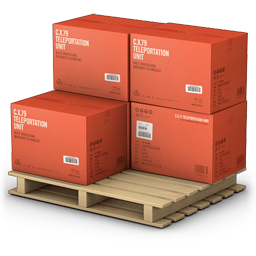

# Quick Stock

[](https://www.codacy.com/app/RDCH106/quick-stock?utm_source=github.com&utm_medium=referral&utm_content=RDCH106/quick-stock&utm_campaign=badger)



Telegram bot for stock management 

Now in develop.... 🛠️

### Installation

You can install from source with:

```
$ git clone https://github.com/RDCH106/quick-stock.git --recursive
$ cd quick-stock
$ pip install -r requirements.txt
```

### Bot Configuration

Any bot in Telegram needs an **Access Token**. To generate it, you have to talk to [@BotFather](https://telegram.me/botfather) and follow a few simple steps (described [here](https://core.telegram.org/bots#6-botfather)). With your Access Token open `config/config.json` and update de Bot Token section:

``` json
"bot" : {
		"token" : "Bot_token"
}
```

Replace `Bot_token` with the Access Token given by the BotFather. Remember save the changes!!

